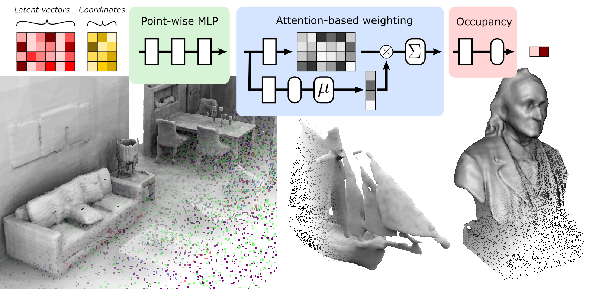

# POCO: Point Convolution for Surface Reconstruction

by: [Alexandre Boulch](https://www.boulch.eu) and [Renaud Marlet](http://imagine.enpc.fr/~marletr/)

Accepted at Computer Vision and Pattern Recognition, CVPR, 2022





---
## Abstract
> Implicit neural networks have been successfully used for surface reconstruction from point clouds. However, many of them face scalability issues as they encode the isosurface function of a whole object or scene into a single latent vector. To overcome this limitation, a few approaches infer latent vectors on a coarse regular 3D grid or on 3D patches, and interpolate them to answer occupancy queries. In doing so, they loose the direct connection with the input points sampled on the surface of objects, and they attach information uniformly in space rather than where it matters the most, i.e., near the surface. Besides, relying on fixed patch sizes may require discretization tuning. To address these issues, we propose to use point cloud convolutions and compute latent vectors at each input point. We then perform a learning-based interpolation on nearest neighbors using inferred weights. Experiments on both object and scene datasets show that our approach significantly outperforms other methods on most classical metrics, producing finer details and better reconstructing thinner volumes.

---
## Citation

```
@article{boulch2022poco,
  title={POCO: Point Convolution for Surface Reconstruction},
  author={Boulch, Alexandre and Marlet, Renaud},
  journal={arXiv preprint arXiv:2201.01831},
  year={2022}
}
```

---
## Installation

The code was used with Ubuntu, Python 3.7.10, Cuda 11.1 and Pytorch 1.8.1

### Installing APT packages

```
apt-get install libgl1-mesa-glx libopenblas-dev
```

### Creating a conda environement

If you want to run the code in a conda environment, you can create one with Python 3.7.10 and CudaToolKit 11.1 using:

```
conda env create -f environment.yml
conda activate poco
```

### Installing dependencies

```
pip install -r requirements.txt
```

### Building the triangle hash module (from ConvONet)

This module is used for score computation

```
python setup.py build_ext --inplace
```
---
## Data

### ShapeNet ([Occupancy Network](https://github.com/autonomousvision/convolutional_occupancy_networks) pre-processing)

We use the ShapeNet dataset as pre-processed by [Occupancy Networks](https://github.com/autonomousvision/convolutional_occupancy_networks). Please refer to original repository for downloading the data.

It should be placed in the folder `data/ShapeNet`.

### SyntheticRooms ([Occupancy Network](https://github.com/autonomousvision/convolutional_occupancy_networks) pre-processing)

We use the SyntheticRooms dataset as created by [Occupancy Networks](https://github.com/autonomousvision/convolutional_occupancy_networks). Please refer to original repository for downloading the data.

It should be placed in the folder `data/synthetic_room_dataset`.

### ABC / RealWorld / Famous and Thingi10k

They should be placed in the folders:
`data/3d_shapes_abc`, `data/3d_shapes_abc_training`, `data/3d_shapes_famous`, `data/3d_shapes_real_world` and `data/3d_shapes_thingi10k`.

### SceneNet

Download the [SceneNet dataset](https://robotvault.bitbucket.io/).

#### Watertight models

We use the code from https://github.com/hjwdzh/Manifold for watertight model creation.
Please download and compile it.

To create the watertight models, create a destination directory `data/SceneNet`, copy-paste the python script `datasets/scenenet_watertight.py` into the directory and run it with `python scenenet_watertight.py`.
You will need to modify the `raw_data_dir` and the `manifold_code_dir` to match your data and code locations.

### Creation of the point clouds

You can use the script `datasets/scenenet_sample.py`. You will also need to modify the paths.

### Precomputed meshes and point clouds

For easy use of the code, we provide precomputed [meshes](https://github.com/valeoai/POCO/releases/download/v0.0.0/watertight_processed_500000.zip), and point clouds [SceneNet20](https://github.com/valeoai/POCO/releases/download/v0.0.0/watertight_processed_500000_points_density20.zip), [SceneNet100](https://github.com/valeoai/POCO/releases/download/v0.0.0/watertight_processed_500000_points_density100.zip), [SceneNet500](https://github.com/valeoai/POCO/releases/download/v0.0.0/watertight_processed_500000_points_density500.zip) and [SceneNet1000](https://github.com/valeoai/POCO/releases/download/v0.0.0/watertight_processed_500000_points_density1000.zip).

### Location

The watertight models should be in `data/SceneNet`.

The points are located in `data/SceneNet20`, `data/SceneNet100`, `data/SceneNet1000` and `data/SceneNet500`.

---
## Training

```bash
# train on ShapeNet with 3k points, noise and without normals 
python train.py --config configs/config_shapenet.yaml 

# train on ShapeNet with 10k points, no noise and normals
python train.py --config configs/config_shapenet.yaml --normals True --random_noise 0 --experiment_name Normals

# train on SyntheticRooms
python train.py --config configs/config_synthetic.yaml

# train on ABC with 3k points
python train.py --config configs/config_abc.yaml --experiment_name 3k

# train on ABC with 10k points
python train.py --config configs/config_abc.yaml --experiment_name 10k --manifold_points 10000 --training_batch_size 8
```

---
## Generation

### ShapeNet

```bash
python generate.py --config results/ShapeNet_None_FKAConv_InterpAttentionKHeadsNet_None/config.yaml --gen_resolution_global 128
```

### SyntheticRooms

```bash
python generate.py --config results/SyntheticRooms_None_FKAConv_InterpAttentionKHeadsNet_None/config.yaml --gen_resolution_global 256 --num_mesh 1
```

### ABC, RealWorld, Famous and Thingi10k

```bash
# Model trained with 3k points
python generate.py --config results/ABC_3k_FKAConv_InterpAttentionKHeadsNet_None/config.yaml --dataset_name DATASET_NAME --dataset_root data/DATASET_DIR --gen_resolution_global 256

python generate.py --config results/ABC_3k_FKAConv_InterpAttentionKHeadsNet_None/config.yaml --dataset_name DATASET_NAME --dataset_root data/DATASET_DIR --gen_resolution_global 256 --manifold_points -1 --gen_subsample_manifold 3000 --gen_subsample_manifold_iter 10 --gen_descriptor gen_sub3k_iter10

# Model trained with 10k points
python generate.py --config results/ABC_10k_FKAConv_InterpAttentionKHeadsNet_None/config.yaml --dataset_name DATASET_NAME --dataset_root data/DATASET_DIR --gen_resolution_global 256

python generate.py --config results/ABC_10k_FKAConv_InterpAttentionKHeadsNet_None/config.yaml --dataset_name DATASET_NAME --dataset_root data/DATASET_DIR --gen_resolution_global 256 --manifold_points -1 --noise 0.0 --gen_subsample_manifold 10000 --gen_subsample_manifold_iter 10 --gen_descriptor gen_sub3k_iter10
```

For faster generation, one would want to use a lower marching cubes parameter `--gen_resolution_global`, e.g. 128.

`DATASET_NAME` should be replaced by `ABCTest`, `ABCTestNoiseFree`, `ABCTestExtraNoise`, `RealWorld`, `FamousTest`, `FamousTestNoiseFree`, `FamousTestExtraNoisy`, `FamousTestSparse`, `FamousTestDense`, `Thingi10kTest`, `Thingi10kTestNoiseFree`, `Thingi10kTestExtraNoisy`, `Thingi10kTestSparse`, `Thingi10kTestDense`

`DATASET_DIR` should be replaced by `3d_shapes_abc`, `3d_shapes_famous`, `3d_shapes_real_world`, `3d_shapes_thingi10k`

### SceneNet

```
python generate.py --config results/ShapeNet_Normals_FKAConv_InterpAttentionKHeadsNet_None/config.yaml --gen_autoscale True --gen_autoscale_target 0.01 --gen_resolution_metric 0.01 --dataset_name DATASET_NAME --dataset_root data/DATASET_NAME --manifold_points -1
```

`DATASET_NAME` should be replaced by `SceneNet20`, `SceneNet100`, `SceneNet500`, `SceneNet1000`.

The `--gen_autoscale_target` parameter is the average distance between a point and its nearest neighbor in the training set, 0.01 for ShapeNet train set with 3000 points.

---
## Evaluation

### ShapeNet

```bash
python eval_meshes.py --gendir results/ShapeNet_None_FKAConv_InterpAttentionKHeadsNet_None/gen_ShapeNet_test_3000/ --meshdir meshes --dataset ShapeNet --split test --gtdir data/ShapeNet
```

### SyntheticRooms

```bash
python eval_meshes.py --gendir results/SyntheticRooms_None_FKAConv_InterpAttentionKHeadsNet_None/gen_SyntheticRooms_test_10000/ --meshdir meshes --dataset SyntheticRooms --split test --gtdir data/synthetic_room_dataset 
```

### SceneNet

```bash
python eval_scenenet.py --gendir results/ShapeNet_Normals_FKAConv_InterpAttentionKHeadsNet_None/gen_SceneNet20_test_allPts/ --meshdir meshes --gtdir data/SceneNet
```

### ABC, Famous and Thingi10k

For evaluation on the ABCTest please run:
```bash
python eval_point2surf_datasets.py --gendir results/ABC_3k_FKAConv_InterpAttentionKHeadsNet_None/gen_ABCTest_test_3000 --meshdir meshes/04_pts/ --gtdir data/3d_shapes_abc/abc/
```
You can adapt the paths to evaluate on the different datasets and noise variants.

---
## Pretrained models

We provide pre-trained models for FKAConv backbone.

[ShapeNet 3k, noise, no normals](https://github.com/valeoai/POCO/releases/download/v0.0.0/ShapeNet_3k.zip)

[ShapeNet 3k, no noise, normals](https://github.com/valeoai/POCO/releases/download/v0.0.0/ShapeNet_3k_normals.zip)

[SyntheticRooms 10k](https://github.com/valeoai/POCO/releases/download/v0.0.0/SyntheticRooms_10k.zip)

[ABC 3k](https://github.com/valeoai/POCO/releases/download/v0.0.0/ABC_3k.zip)

[ABC 10k](https://github.com/valeoai/POCO/releases/download/v0.0.0/ABC_10k.zip)

